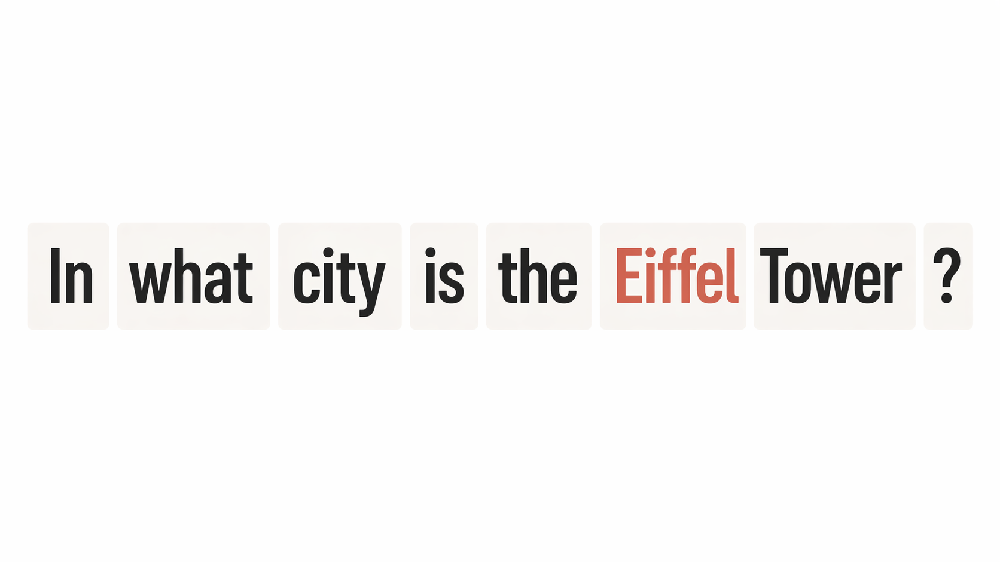
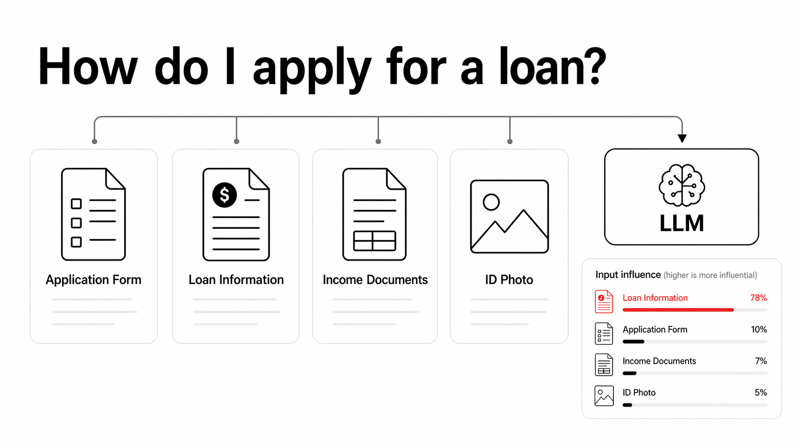

<p align="center">
  
</p>

# llmSHAP

`llmSHAP` is a multi-threaded explainability framework for LLM outputs.

Consider starring the repository: [github.com/filipnaudot/llmSHAP](https://github.com/filipnaudot/llmSHAP)

Start here:

- Repository: [llmSHAP](https://github.com/filipnaudot/llmSHAP)
- Tutorial: [Hands-on tutorial](https://filipnaudot.github.io/llmSHAP/tutorial.html)


## What llmSHAP does

`llmSHAP` helps you answer a simple question:

> Which parts of the input mattered most for the model's output?


You give it:

- an input, either as a words, strings, images, or a mix using the `DataHandler`
- an LLM interface wrapper (OpenAI interface implemented, feel free to implement you own)
- a prompt codec

It returns:

- the model output
- attribution scores for each input feature


## Getting started

### 1. Install `llmSHAP`

If you just want to use the package:

```bash
pip install "llmshap[all]"
```

If you want to work from a local clone:

```bash
git clone https://github.com/filipnaudot/llmSHAP.git
cd llmSHAP
pip install -e ".[all]"
```


### 2. Set your API key

For the OpenAI examples below, make sure your API key is available in your environment (`.env` file):

```bash
export OPENAI_API_KEY=your_api_key_here
```


## Where to go next

- Read the full repository: [github.com/filipnaudot/llmSHAP](https://github.com/filipnaudot/llmSHAP)
- Follow the tutorial: [filipnaudot.github.io/llmSHAP/tutorial.html](https://filipnaudot.github.io/llmSHAP/tutorial.html)


